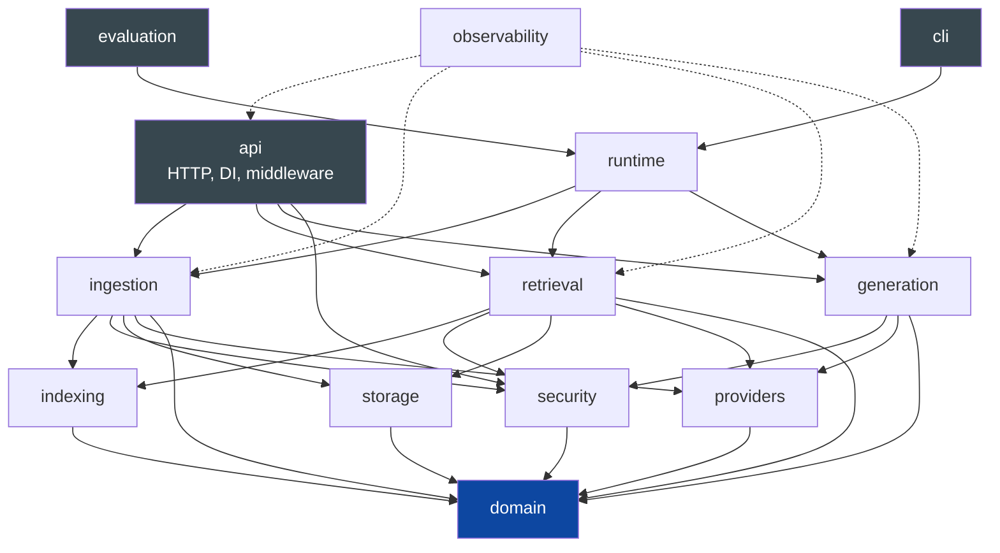
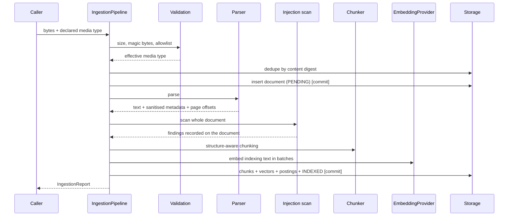
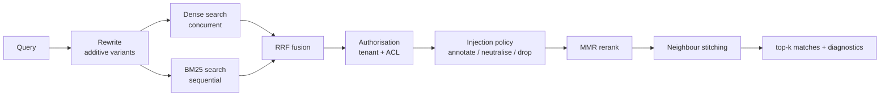
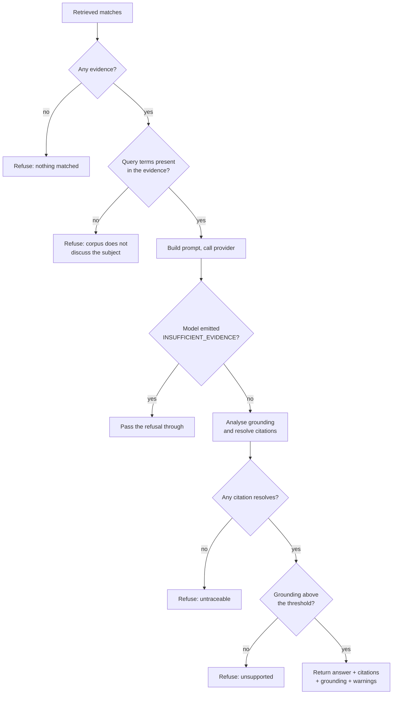
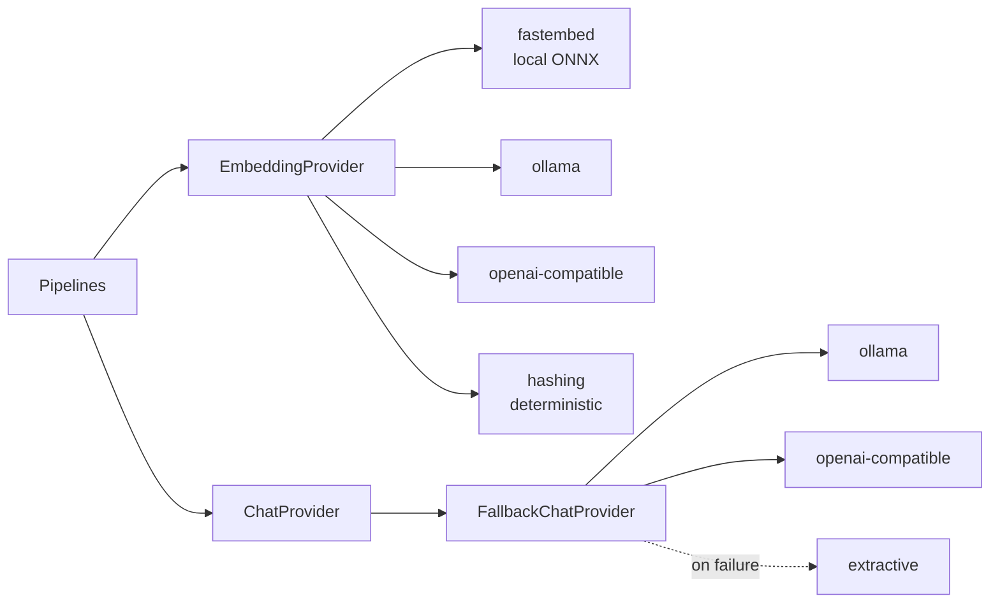

# Architecture

This document explains how the service is put together and, more usefully, why
each significant decision was made and what would change it.

## Contents

- [Shape of the system](#shape-of-the-system)
- [The trust model](#the-trust-model)
- [Ingestion](#ingestion)
- [Indexing](#indexing)
- [Retrieval](#retrieval)
- [Generation](#generation)
- [Storage](#storage)
- [Providers](#providers)
- [Observability](#observability)
- [Evaluation](#evaluation)
- [Decision records](#decision-records)
- [What would have to change to scale](#what-would-have-to-change-to-scale)

---

## Shape of the system

Nine packages, each with one job, arranged so that dependencies point inwards
towards the domain model.

`domain` depends on nothing but Pydantic. `observability` is depended on by
everything and depends on nothing in the application. Every other package can be
tested in isolation, which is why the unit suite needs no database.

`runtime.py` exists because the HTTP layer is only one way to drive the system.
The CLI and the evaluation harness assemble the same object graph, so the
evaluator measures the real pipeline rather than the pipeline plus a network
hop.

## The trust model

The single decision everything else defers to: **retrieved document text never
carries authority.**

Every string that reaches a prompt is a `PromptSegment` tagged with a
`TrustLevel`:

| Level | Origin | May do |
| --- | --- | --- |
| `SYSTEM` | This application's own policy text | Define behaviour |
| `USER` | An authenticated caller's question | Express intent |
| `UNTRUSTED` | Retrieved passages, fetched documents | Be evidence, nothing more |

`build_prompt` is the only function that assembles a prompt. It places
`UNTRUSTED` content exclusively inside per-request, nonce-delimited evidence
blocks in the user role. There is no code path that puts document text into a
system message, and `tests/security/test_indirect_prompt_injection.py` asserts
that structurally rather than by inspecting behaviour.

Detection (`security/injection.py`) is a second layer, deliberately subordinate
to that structural one. See [THREAT-MODEL.md](THREAT-MODEL.md).

## Ingestion

Three details are load-bearing:

**Validation precedes parsing.** A parser is the wrong place to discover that a
file claiming to be a PDF is a ZIP. `validate_upload` reads magic bytes and
refuses archives and executables outright, whatever the allowlist says.

**The pipeline owns its transactions.** Each stage commits. The `status` column
exists so a failure is *recorded*; if the failure were written inside the
transaction that the failure rolls back, the row would vanish and an operator
would see a document that simply never arrived. `_record_failure` therefore
opens a fresh transaction.

**Chunk text and indexing text are different strings.** `Chunk.text` is the
passage as the document wrote it. `Chunk.indexing_text` prepends the heading
breadcrumb, and that is what gets embedded and indexed. Retrieval benefits from
"Refunds > Eligibility" being part of the embedding; a citation quote that
begins with a synthesised breadcrumb reads as though the document said it.

## Indexing

Two indexes, written in the same transaction, so a chunk is never searchable by
one and not the other.

**Dense.** `float32` vectors stored beside the chunk. `NumpyVectorStore` loads a
tenant's vectors into a matrix and scores by a single matrix-vector product —
exact search, no recall loss, no index to build or tune. The cache is keyed by
`(tenant, embedding provider)` and carries a generation counter that ingestion
and deletion bump, because a stale cache answering from deleted documents is a
data-exposure bug, not a performance one.

**Sparse.** A real inverted index in the `postings` table, with Okapi BM25 over
it. Deletions take effect immediately and term statistics are computed from the
same rows, so they cannot drift from the corpus.

Both use `indexing.text.terms` so the tokenisation used at write time and at
query time cannot diverge.

## Retrieval

Ordering choices worth stating:

- **Authorisation runs before the injection scan and before reranking.** No
  work, and no diagnostic signal, is spent on documents the caller cannot see.
- **Fusion is rank-based.** A cosine similarity of 0.82 and a BM25 score of 14.3
  cannot be added without inventing a normalisation that changes whenever the
  corpus changes. RRF combines ranks instead.
- **Dense searches run concurrently; sparse searches do not.** The sparse path
  shares the request's `AsyncSession`, which is not safe for concurrent use and
  would not parallelise anyway, since a session holds one connection.
- **Stitching reuses the policy-applied text.** Re-reading the matched chunk
  from the repository at stitch time would silently reinstate spans that had
  just been neutralised. That was a real bug, and there is a regression test.

Every stage records its latency into `RetrievalDiagnostics`, and `GET /v1/retrieve`
returns it. "The answer is wrong" is almost always a retrieval problem, and
diagnosing it should not require a model call.

## Generation

The model produces text. Everything that decides whether that text reaches the
caller lives in `generation/answerer.py`, outside the model:

Each early return is a distinct, independently auditable reason to withhold an
answer, which is why the method has several rather than nested conditionals.

The **evidence-coverage gate** deserves a note. Retrieval always returns
something — the nearest passages exist even when nothing in the corpus concerns
the question — and a model handed plausible but irrelevant evidence will often
answer from it. Checking whether the retrieved text even mentions the query's
subject terms catches that deterministically, before a model is called.
Interrogative scaffolding ("how long", "what is") is excluded, because a corpus
is not required to contain the words a question is phrased with.

## Storage

SQLAlchemy 2.0, async, five tables:

| Table | Holds | Notes |
| --- | --- | --- |
| `documents` | Metadata, lifecycle status, ACL | Unique on `(tenant_id, content_sha256)` |
| `chunks` | Text, `float32` vector, provider id, term count | Cascade-deleted with the document |
| `postings` | `(tenant, term, chunk)` | The inverted index |
| `sessions` | Conversation turns, bounded | Feeds query rewriting |
| `audit_events` | Identifiers, rule ids, scores, decisions | No document or query text |

SQLite is the default so a clean clone runs with no services. Two pragmas are
applied on connect: `foreign_keys=ON`, without which SQLite silently ignores the
declared cascades and orphans chunks; and `journal_mode=WAL`, so a query can
read while an ingestion writes.

Production requires PostgreSQL, and startup refuses a SQLite URL when
`RAG_ENVIRONMENT=production`.

## Providers

Two protocols, `EmbeddingProvider` and `ChatProvider`. The application depends on
nothing else, so changing model vendor is a configuration change.

`FallbackChatProvider` is the answer to "what happens when the model is
unavailable?". It is not a retry loop — the transport already retries transient
failures with jittered backoff. It handles the case where retries were
exhausted, the model is not installed, or the configuration is wrong: rather
than a 502, the caller gets an extractive answer over the same evidence, and the
response says so. Degrading silently would be worse than failing.

The `extractive` and `hashing` backends are genuine implementations, not
placeholders — extractive QA and the signed hashing trick respectively — chosen
so a clean clone works with no credentials. `/readyz` names them so a deployment
running on them is never silent about it.

## Observability

- **Logs.** structlog through `ProcessorFormatter`, so application records and
  third-party stdlib records (uvicorn, httpx) share one JSON format and one
  redaction pass. Redaction is the last processor in the chain and runs again
  after tracebacks are rendered, because a control that depends on every future
  call site remembering it is not a control.
- **Traces.** OpenTelemetry spans for `ingestion.pipeline`,
  `retrieval.pipeline` and `generation.answer`. Trace and span ids are injected
  into every log record, so a log line is clickable from a trace view.
- **Metrics.** Counters and histograms for ingestion outcomes, answer outcomes,
  injection findings, latency and the grounding-score distribution.

The two signals worth alerting on are the grounding distribution and the
injection-finding rate. Both are leading indicators of corpus problems, and
neither is visible from request latency.

## Evaluation

`evaluation/` is a small harness, not a framework: a JSONL dataset, a set of
metrics computed from observed behaviour, and a runner that builds a fresh index
in a temporary database, executes every case through the real pipeline, and
exits non-zero if a threshold is violated.

Cases assert at two levels — which documents must be retrieved, and how the
answer must behave — so a retrieval regression is distinguishable from a
generation regression. Adversarial cases are gated at 100%.

Building the index fresh each run costs a few seconds and buys determinism: a
stale index cannot make broken retrieval look healthy.

---

## Decision records

### ADR-1: No RAG framework

**Decision.** No LangChain, no LlamaIndex. The pipeline is written out.

**Why.** The pipeline is about ten explicit stages, and the interesting
decisions — where the trust boundary sits, what fusion does, when to refuse —
are exactly the ones a framework hides behind a chain abstraction. Writing them
out is more code and considerably less indirection.

**Cost.** Connectors and integrations must be written rather than imported.

### ADR-2: Exact NumPy search rather than an ANN index

**Decision.** Dense retrieval scans a cached per-tenant `float32` matrix.

**Why.** At 100k chunks × 384 dimensions this is roughly a 150 MB working set and
tens of milliseconds on one core — faster than the embedding call that produced
the query vector, with exact recall and nothing to tune, rebuild or monitor for
drift.

**When to revisit.** Above roughly a few hundred thousand chunks per tenant, or
when the working set stops fitting comfortably in memory. `VectorStore.search`
is the seam; a `pgvector` implementation replaces it and nothing else.

### ADR-3: Deterministic query rewriting

**Decision.** Reference resolution, identifier expansion and decomposition are
rule-based, not model-based.

**Why.** A model call here would add latency to every query, introduce a second
place the system can hallucinate, and make retrieval regression tests
non-reproducible. Rewrites are additive — the original query is always retrieved
for — so a bad rewrite can add noise but never remove the correct result.

**Cost.** It handles the cases that actually occur, not arbitrary paraphrase.

### ADR-4: Grounding by term coverage rather than an LLM judge

**Decision.** A sentence is supported when enough of its content terms appear in
the passage it cites.

**Why.** Deterministic, no latency, no cost, cannot itself hallucinate, and
testable against a fixed dataset. An LLM judge is a second model that can be
wrong in correlated ways with the model it judges.

**Cost.** It detects a sentence discussing something the passage does not
mention; it does not reliably detect a reversal of meaning such as a dropped
"not". The regression dataset measures that residual gap, and the README states
it as a limitation.

### ADR-5: Corroboration required before a passage is dropped

**Decision.** The risk threshold forces a drop only when at least two distinct
detection rules fired.

**Why.** The highest severity any single rule carries is 0.9, and documents that
legitimately *discuss* an attack — a security policy, an incident report, this
project's own threat model — reliably match exactly one rule. Requiring two
independent signals is what separates quoting an attack from attempting one. The
regression corpus contains both, and the suite fails if either is mishandled.

### ADR-6: Ingestion is synchronous

**Decision.** An upload is parsed, chunked, embedded and indexed within the
request.

**Why.** It makes the failure path obvious and the API honest: the response says
how many chunks were created and what was flagged. A queue would add a broker, a
worker, a job table and a polling endpoint for a workload that is currently
seconds long.

**When to revisit.** When documents routinely exceed a few megabytes, or when
ingestion volume makes request-bound work unacceptable. `IngestionPipeline`
already owns its transactions, so moving it behind a queue does not change its
internals.

### ADR-7: `create_all` rather than migrations

**Decision.** The schema is created at startup from the ORM metadata.

**Why.** One service owns this schema and it ships with the code. Alembic adds a
migration directory, a version table and a review step for a schema that has no
second writer.

**When to revisit.** The first time a column must be changed in a deployment
whose data must survive, or the first time a second service writes these tables.
`docs/operations.md` records the adoption path.

---

## What would have to change to scale

Honest list, in the order the limits would actually be hit:

| Limit | Symptom | Change |
| --- | --- | --- |
| ~100k chunks per tenant | Dense search latency and memory grow linearly | `pgvector` + HNSW behind `VectorStore` |
| Large documents | Requests block for the duration of ingestion | Queue + worker behind `IngestionPipeline` |
| Many tenants per process | Vector cache memory grows with active tenants | LRU eviction on the cache, or a shared ANN index |
| High query volume | BM25 postings reads dominate | Read replica, or PostgreSQL full-text search |
| Corpus churn | Re-embedding on model change is a full reindex | Incremental re-embedding with dual-provider reads |

None of these are implemented. All of them are behind an existing seam.
