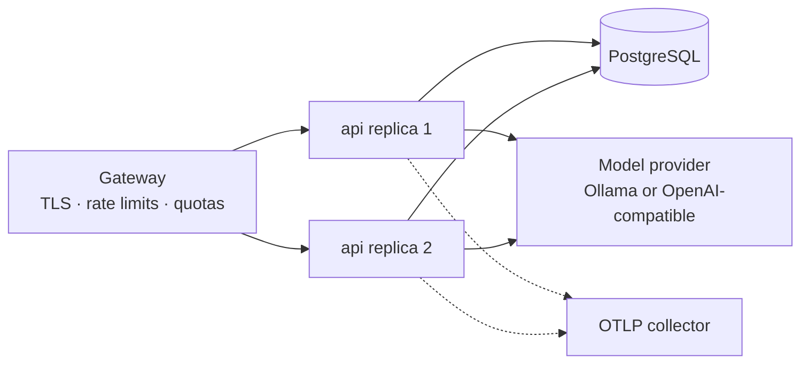

# Operations

Running this service in an environment where it matters.

## Deployment shape

A stateless container. All state is in PostgreSQL. Scale horizontally; the only
per-process state is the dense vector cache, which is rebuilt on demand and
invalidated by a generation counter.



The gateway is not optional. This service implements no rate limiting and no
quotas; that is stated as a limitation in [SECURITY.md](../SECURITY.md).

## Production configuration

```bash
RAG_ENVIRONMENT=production
RAG_STORAGE__DATABASE_URL=postgresql+psycopg://rag:${DB_PASSWORD}@db:5432/rag
RAG_STORAGE__POOL_SIZE=10

RAG_SECURITY__REQUIRE_API_KEY=true
RAG_SECURITY__API_KEYS=${API_KEYS_FROM_SECRET_MANAGER}
RAG_SECURITY__INJECTION_ACTION=neutralise

RAG_EMBEDDING__BACKEND=fastembed
RAG_EMBEDDING__MODEL=BAAI/bge-small-en-v1.5
RAG_EMBEDDING__DIMENSIONS=384
RAG_EMBEDDING__CACHE_DIR=/app/var/models

RAG_CHAT__BACKEND=ollama
RAG_CHAT__MODEL=llama3.2:3b
RAG_PROVIDERS__OLLAMA_BASE_URL=http://ollama:11434

RAG_OBSERVABILITY__LOG_FORMAT=json
RAG_OBSERVABILITY__TRACING_ENABLED=true
RAG_OBSERVABILITY__OTLP_ENDPOINT=http://collector:4318/v1/traces
RAG_OBSERVABILITY__TRACE_SAMPLE_RATIO=0.1
```

**Startup will refuse to serve** if the environment is `production` and any of
these holds: authentication is disabled, the database URL is SQLite,
private-network fetching is enabled, document-content logging is on, or SQL echo
is on. That is deliberate — a misconfigured deployment should fail loudly rather
than silently drop a control.

Verify before rollout:

```bash
docker run --rm --env-file production.env rag-research-assistant:TAG \
  python -c "from rag_assistant.config import get_settings; \
             get_settings().enforce_environment_invariants(); print('configuration ok')"
```

## Probes

| Probe | Path | Behaviour |
| --- | --- | --- |
| Liveness | `/healthz` | Never touches a dependency. Always `200` while the process runs. |
| Readiness | `/readyz` | Checks the database and the model provider. `503` when a required component is unavailable. |

```yaml
livenessProbe:
  httpGet: {path: /healthz, port: 8000}
  initialDelaySeconds: 10
  periodSeconds: 20
readinessProbe:
  httpGet: {path: /readyz, port: 8000}
  initialDelaySeconds: 5
  periodSeconds: 10
```

**Do not point liveness at `/readyz`.** A slow database would then restart a
healthy process during an incident, converting a degradation into an outage.

`/readyz` also returns `warnings`. A production deployment reporting the
`hashing` or `extractive` backend is running on development-grade components;
alert on it.

## Schema management

The schema is created at startup from the ORM metadata (`create_all`). One
service owns it and it ships with the code, so a migration tool would add a
directory, a version table and a review step for a schema with no second writer.

**When to adopt Alembic** — the first time either is true:

- a column must change in a deployment whose data must survive, or
- a second service writes these tables.

Adoption path:

```bash
uv add --dev alembic
uv run alembic init migrations
uv run alembic revision --autogenerate -m "baseline matching 0.1.0"
uv run alembic stamp head        # on an existing deployment
```

Then replace the `create_schema` call in the lifespan with an
`alembic upgrade head` step in the deployment pipeline, not in the application.

## Backups

Everything durable is in PostgreSQL. Back it up as you would any other database.
There is no separate index to back up: vectors and postings live in the same
tables and are consistent with their chunks by construction.

Restoring is a plain database restore. No reindex is required unless the
embedding provider or model changed.

## Reindexing

Required when `RAG_EMBEDDING__BACKEND` or `RAG_EMBEDDING__MODEL` changes.
Vectors record which provider produced them, and search filters on it, so after
a change dense retrieval returns nothing rather than ranking across incompatible
embedding spaces. BM25 keeps working throughout, so the service degrades rather
than failing.

```bash
# 1. Deploy with the new embedding configuration. Dense search is empty;
#    sparse search still answers.
# 2. Re-ingest the corpus from source. Deduplication is by content digest,
#    so re-uploading an unchanged document is a no-op you must first delete.
# 3. Confirm dense search is live again:
curl -G "$BASE/v1/retrieve" -H "X-API-Key: $KEY" --data-urlencode "q=<known term>"
#    dense_candidate_count should be non-zero.
```

There is no incremental re-embedding. It is on the roadmap.

## Capacity

Measured on one core with the 384-dimension configuration:

| Dimension | Behaviour |
| --- | --- |
| Dense search | O(n) over the tenant's chunks. ~150 MB and tens of ms at 100k chunks × 384 dims |
| Vector cache | One `float32` matrix per active `(tenant, provider)` pair, held for the process lifetime |
| BM25 | Postings read per query; index-only scan on PostgreSQL via `(tenant_id, term)` |
| Ingestion | Dominated by embedding. Batched at `RAG_EMBEDDING__BATCH_SIZE` |
| Query rewriting | Up to three extra retrievals, dense ones run concurrently |

Memory planning: budget `chunks × dimensions × 4 bytes` per active tenant, plus
the process baseline. Ten active tenants at 50k chunks and 384 dimensions is
roughly 770 MB of cache.

Above a few hundred thousand chunks per tenant, move to `pgvector`. See
[ARCHITECTURE.md](../ARCHITECTURE.md#adr-2-exact-numpy-search-rather-than-an-ann-index).

## What to alert on

Ordered by how early they warn you:

| Signal | Metric | Why it matters |
| --- | --- | --- |
| Grounding distribution falling | `rag.answer.grounding_score` | Retrieval quality is degrading before anyone complains |
| Refusal rate rising | `rag.queries.answered{outcome}` | Corpus gaps, or a retrieval regression |
| Injection findings rising | `rag.security.injection_findings` | Someone is putting hostile documents in the corpus |
| Degraded generation | `finish_reason=degraded_extractive` in logs | The model provider is down and answers are quietly worse |
| Ingestion failures | `rag.documents.ingested{status=failed}` | A source system is producing documents this service cannot read |
| p95 query latency | `rag.query.duration` | The usual |
| Readiness warnings | `/readyz` | Running on development backends in production |

The first three are the ones that distinguish this from a generic web service.
None is visible from request latency or error rate.

## Log fields

Every record is JSON with `timestamp`, `level`, `logger`, `event`, `service`,
and where applicable `request_id`, `trace_id`, `span_id` and `tenant_id`.

Document and query text are excluded by default and refused outright in
production. Secrets are redacted by a processor at the end of the chain, and
again after tracebacks are rendered.

Useful events:

| Event | Meaning |
| --- | --- |
| `ingestion.completed` / `ingestion.failed` | Document accepted or rejected |
| `security.injection_at_ingest` | A document carried instruction-like text |
| `security.injection_detected` | A retrieved passage did; `decision` says what happened |
| `security.context_dilution` | Most of the retrieved context is instruction-shaped |
| `generation.refused_ungrounded` | An answer was withheld for lack of support |
| `generation.refused_low_coverage` | The corpus does not discuss the question |
| `provider.degraded` | The primary model failed and the fallback answered |
| `provider.retry` | A transient upstream failure was retried |

## Runbook: common incidents

**Every query is refused.**
Check `/readyz`. Then `GET /v1/retrieve` with a term you know is in the corpus.
`dense_candidate_count == 0` with a healthy sparse count means the embedding
model changed without a reindex.

**Answers became vague or wrong after a deploy.**
Compare `rag.answer.grounding_score` before and after. Run the evaluation gate
against the deployed configuration:
`uv run rag-assistant evaluate data/regression/dataset.jsonl`.

**Answers carry a degraded-generation warning.**
The model provider is unreachable. `provider.degraded` names it. The service is
still answering, extractively.

**A tenant reports missing documents.**
`GET /v1/documents?status=failed`. Failed documents keep a client-safe reason in
`error`. Then check the audit trail for `document.ingest` with `outcome=failed`.

**Injection findings spike.**
`GET /v1/audit` and filter on `document.ingest`; the `injection_rules` attribute
names which rules fired. Consider switching
`RAG_SECURITY__INJECTION_ACTION` to `drop` for that tenant while investigating.

## Cost

Self-hosted with Ollama and fastembed: compute and storage only, no per-token
cost. That is the configuration the defaults point at.

With a hosted provider, cost is dominated by prompt tokens, which scale with
`RAG_RETRIEVAL__TOP_K` and `RAG_GENERATION__MAX_CONTEXT_CHARS`. The query
response reports `prompt_tokens` and `completion_tokens` per request, and the
evaluation report totals them per run — measure before tuning.

## Infrastructure as code

None is shipped. Deliberately: the service is a stateless container plus a
PostgreSQL instance, and a Terraform module here would encode assumptions about
one cloud, one networking model and one secret manager that would not match
yours, while creating the impression that provisioning it is free.

What a deployment needs, in any provider's vocabulary:

- A container runtime that can run the image as a non-root user
- A managed PostgreSQL instance, private, encrypted at rest, with backups
- A secret manager for `RAG_SECURITY__API_KEYS` and the database password
- A gateway terminating TLS and enforcing rate limits
- A log sink that accepts JSON, and optionally an OTLP endpoint
- A persistent volume or baked-in model cache if `RAG_EMBEDDING__BACKEND=fastembed`

`docker-compose.yml` in the repository root is the runnable reference for how
these fit together.
